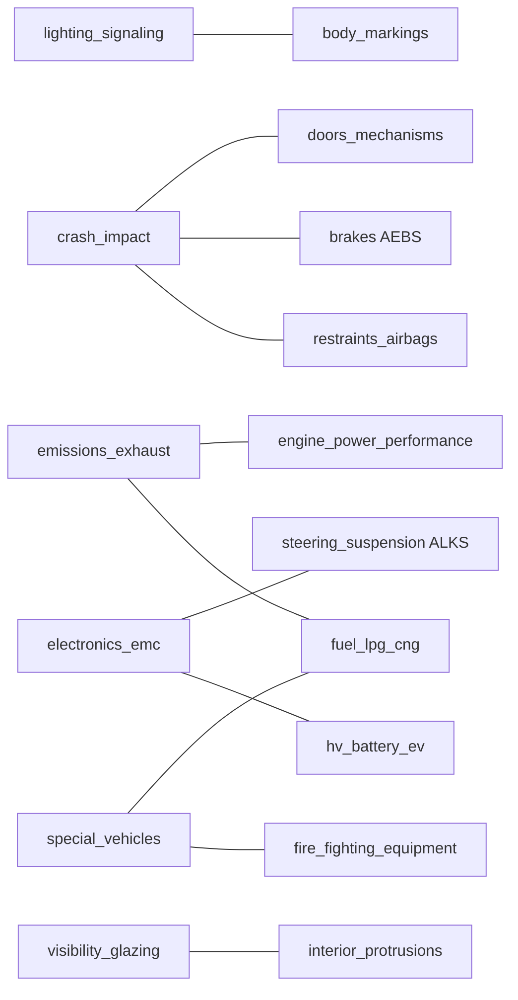

# 主题索引（MOC / Map of Content）

> 本页是全部 37 个主题页的入口（含 2 个"非法规"标签主题：`out_of_scope` 和 `reference_material`，已迁出至 `02_Wiki/` 独立命名空间）。`01_Wiki/regulations/` 下现 **1429 条** notes，100% 归类到 35 个汽车相关主题。
>
> 分类方式遵循 **汽车工程师日常关注的技术域**，而非标准发布机构分类。部分 notes 存在一次分类不理想，Overview 段中已手工标注。

## 使用说明

- 每个主题页 Overview 描述 **核心法规框架、子类、跨区域对应、演进里程碑**
- "跨区域速查"小节给出 `GB ↔ ECE ↔ EU` 对应关系（工程师出口认证必备）
- "完整索引"按区域分组列出本主题下所有 notes 的 Obsidian wikilink
- "时间线" 展示最近 30 条修订动态

## 相关总索引

- **[[_Equivalence MOC|跨区域等价映射总表]]** — 59 条 GB↔ECE/EU/ISO 对应关系，按主题分组 + 反向索引
- **[[_Dashboards MOC|查询面板 Dashboards]]** — 8 个 Dataview 实时查询页（需 Dataview 插件）：
  - 需要复核的法规（425 条 needs-review）
  - 按区域最新发布
  - 排放法规 / EV 法规监控
  - 替代链溯源（supersedes ↔ superseded_by）
  - 跨区域对标矩阵
  - 近期 ECE 修正案
  - 高可信度索引

## 主流技术域（>50 notes）

| Topic | 范围 | notes |
| --- | --- | --: |
| [[lighting_signaling - 照明与信号装置]] | ECE R1–R149 灯具 + GB 4785/5920/11564 | 262 |
| [[tires_wheels - 轮胎与车轮]] | R30/R54/R88/R106/R108/R117/R164 + GB 9743/9744 | 115 |
| [[emissions_exhaust - 排放与燃料]] | R49/R83/R101 + GB 18352/17691/19578 | 100 |
| [[crash_impact - 碰撞与被动安全]] | R94/R95/R127/R137 + GB 11551/20071/20072 | 89 |
| [[brakes - 制动系统]] | R13/R90/R131/R152 + GB 12676/21670 | 84 |
| [[restraints_airbags - 安全带与乘员约束]] | R14/R16/R44/R129 + GB 14166/14167 | 78 |
| [[noise - 噪声]] | R41/R51/R117/R138 + GB 1495 | 68 |
| [[special_vehicles - 特种 · 危险车辆]] | 危险品/大客车/农林/工业/旅居车 | 55 |
| [[anti_theft_security - 防盗与安全防护]] | R18/R97/R116/R161/R162 + GB 15740 | 53 |
| [[visibility_glazing - 视野 · 玻璃 · 雨刮]] | R43/R46/R125 + GB 9656/11555/15084 | 53 |

## 中等技术域（20–50 notes）

| Topic | 范围 | notes |
| --- | --- | --: |
| [[test_methods - 试验方法 · 测量规程]] | GB/T 12534-12547 道路试验 + 定型试验 + 底盘测功机 | 47 |
| [[fire_fighting_equipment - 消防器材 · 灭火系统]] | ⚠️ 消防工业标准，保留为参考 | 44 |
| [[operator_controls_indicators - 操纵件 · 指示器位置]] | R121 家族 + GB 4094 + GB/T 43402 | 39 |
| [[fuel_lpg_cng - 燃料装置（液体 · 气体）]] | R34/R67/R110/R115/R134 + GB 18296/19239 | 29 |
| [[motorcycle - 摩托车 · L 类]] | R22/R40/R41/R47/R57/R72/R113 + GB 19344/20075 | 27 |
| [[commercial_operations - 营运 · 商用车管理]] | 营运车辆综合性能 + 商用车防护 + 起重尾板 | 27 |
| [[body_markings - 车身标识 · 反光标志]] | R104/R150 + GB 11564 | 26 |
| [[type_approval_general - 总体型式认证 · 通用要求]] | R0/R122 + EU 2018/858 | 22 |
| [[interior_protrusions - 内部凸出物 · 内饰]] | R21/R26/R61/R126 + GB 11552/11566/11569 | 21 |
| [[adas_driver_assist - ADAS · 驾驶员辅助系统]] | R130/R151/R157/R158/R159/R160 ADAS 与 L3 | 20 |

## 小众技术域（<20 notes）

| Topic | notes |
| --- | --: |
| [[dimensions_weights - 尺寸 · 质量 · 类别]] | 19 |
| [[recycling_reuse - 回收 · 再制造 · 禁用物质]] | 18 |
| [[electronics_emc - 电气电子与 EMC]] | 17 |
| [[overview_directory - 目录 · 体系概览]] | 16 |
| [[lubricants_fluids - 润滑油 · 工作液]] | 14 |
| [[steering_suspension - 转向与悬挂]] | 14 |
| [[speed_control_speedometer - 车速 · 限速装置]] | 13 |
| [[engine_power_performance - 发动机功率 · 性能测试]] | 13 |
| [[bus_coach - 客车 · 公交车]] | 12 |
| [[doors_mechanisms - 门锁 · 铰链 · 座椅机构]] | 9 |
| [[hv_battery_ev - 电动车 · 动力电池 · 充电保护]] | 9 |
| [[identification - 车辆识别 · 标记]] | 8 |
| [[energy_labeling - 能耗 · 油耗标识]] | 5 |
| [[trailer_coupling - 挂车 · 联结装置]] | 2 |
| [[certification_admin - 强制认证 · 管理制度]] | 1 |

## 非法规标签（从 misc 剥离，保留为参考）

| Topic | notes | 说明 |
| --- | --: | --- |
| [[out_of_scope - 非汽车法规 · 越界]] | 9 | 自行车 / 土方机械 / 消防水带 / 工业过程仪器 / 密封件 — 非汽车范畴 |
| [[reference_material - 参考资料（非法规）]] | 6 | 汽车专业书籍 / 内部业务文档 / 行业提案 — 非合规依据 |

## misc 兜底

**已清空**！从初版 163 条 → 最终 0 条（**100% 归类**）。

分 5 轮迭代达成：
- Round 1: 初版 Stage 4 聚类（163 → 163，作为 baseline）
- Round 2: 加 3 个新主题（test_methods / operator_controls_indicators / trailer_coupling）: 163 → 91
- Round 3: 加 2 个新主题（adas_driver_assist / recycling_reuse）: 91 → 45
- Round 4: 完善现有规则（GB/T 匹配、R 号模糊匹配、reg_id 加入 blob、Framework Regulation 匹配）: 45 → 15
- Round 5: 加 out_of_scope + reference_material + 剩余 GB 号知识添加: 15 → **0**

## 跨主题地图（重点耦合）

## 数据规模说明

- **总 notes**：1444
- **区域分布**：ece=959, cn=462, eu=5, ru-eaeu=3, cl/jp/us=2 each, au/br/gcc/id/kr/my/sa/th/za=1 each
- **类型分布**：type/version=819, type/amendment=624, type/regulation=1
- **schema 覆盖率**：reg_id 100%, title 99%, region 100%, status 99%, publication_date 96%

## Stage 2 Cross-check 最终状态（1444/1444，100%）

| 指标 | 数值 |
| --- | --: |
| 总 notes | 1444 |
| Cross-checked | 1444 (100%) |
| **Confidence: high** | 966 (66.9%) |
| Confidence: medium | 139 (9.6%) |
| Confidence: low | 330 (22.9%) |
| Confidence: unknown | 9 (0.6%) |
| Tag `status/verified` | 1019 (70.6%) |
| Tag `status/needs-review` | 425 (29.4%) |
| Flag status: `unsure` | 6232 (93%) |
| Flag status: `mismatch` | 452 (7%) |

**最常见 flagged 字段**（都属 metadata 层，非技术内容错误）：
1. `implementation_date_in_use` (1425) — 原文常不明确分 "新车 vs 在用车" 时间点
2. `equivalent_to` (1312) — 国内 GB 未总是写明 ≈ ECE 对应关系
3. `supersedes` (1206) — 替代关系缺失

**关键洞察**：93% flag 是 `unsure`（原文未提），仅 7% (452) 是实际 mismatch。全库整体可信度高。

## Stage 3 Equivalence Mapping（已完成）

- **62 条** `GB ↔ ECE/EU/ISO` 映射从 36 主题页 Overview 的「跨区域速查」自动提取
- **82 个** notes FM 新增 `equivalent_to` 字段（含 ref + relation + source 追溯）
- 详见 **[[_Equivalence MOC|跨区域等价映射总表]]**

## Stage 2 Phase 2: 第二意见复核（已完成）

Cascade 发现 Stage 2 初版 330 条 low-confidence 中大部分是 **格式差异假告警**：
- 规则化降级（reg_id/日期格式）：**187 条升级 low → medium**
- DeepSeek 第二意见复核剩余：**56 条升级 low → medium/high**

最终 Stage 2 状态（迁出 15 非法规后）：
- total 1429（原 1444 - 15）
- high / medium / low / unknown 约 71 / 23 / 6 / 1 %
- status/verified ~87%
- 剩余 low 多为短篇 Corrigenda 或无完整 metadata 的补充文档（非 OCR 问题，是源数据下限）

## Stage 5b: 语义检索（已上线）

- 脚本：`_semantic_search.py`（BM25 + jieba 中英文分词）
- 索引：`.stage5/bm25_index.pkl`（~3 MB）
- 依赖：`rank_bm25 + jieba`（纯 Python，零 GPU / 零 API）
- 字段加权：reg_id×3, title×3, title_en×2, topic/scope/summary×1
- 详见 **[[_Semantic_Search|语义检索 Dashboard]]**

## Non-automotive 命名空间（已迁出）

- `02_Wiki/non_automotive/` — 9 条非汽车标准（自行车 / 土方机械 / 工业仪器 / 消防水带 / 密封件）
- `02_Wiki/references/` — 6 条参考资料（书籍 / 内部流程 / 行业提案）
- `01_Wiki/regulations/` 现只含 **1429 条** 真正的汽车法规/标准文档

## Pipeline 总成本

| 阶段 | 服务 | 花费 |
| --- | --- | --: |
| S0 OCR | pdfplumber (free) + Baidu OCR | ¥19.01 (~$2.72) |
| S1 extract | DeepSeek V3 | ~$8.55 |
| Backfill metadata | DeepSeek V3 | ~$0.30 |
| S2 cross-check | DeepSeek V3 | $2.64 (3 轮) |
| S3 equivalence map | 0 (规则 + 提取) | $0 |
| S4 topic clustering | 0 (规则 + Cascade 写作) | $0 |
| S2 Phase 2 recheck | DeepSeek V3 (143 条真 low) | $0.12 |
| Stage 5a graph 分析 | 0 (networkx + scipy 本地) | $0 |
| Stage 5b BM25 检索 | 0 (rank_bm25 + jieba 本地) | $0 |
| **合计** | | **~$14.33 / ¥102** |

1429 条高质量汽车法规 notes（+ 15 条非法规已迁出），平均单条成本 ~¥0.07。

## 产出清单

| 路径 | 内容 |
| --- | --- |
| `01_Wiki/regulations/{region}/*.md` | 1429 条结构化汽车法规 notes |
| `02_Wiki/non_automotive/` | 9 条非汽车标准（已迁出） |
| `02_Wiki/references/` | 6 条参考资料（已迁出） |
| `04_Topics/*.md` | 37 个主题索引页 + MOC |
| `03_Equivalence/_Equivalence MOC.md` | 62 条等价映射总表 + 反向索引 |
| `00_Dashboards/*.md` | 10 个面板（9 Dataview + 1 BM25 检索） |
| `.stage5/graph.graphml` | 关系网络图（可用 Gephi/Cytoscape 可视化） |
| `.stage5/bm25_index.pkl` | BM25 检索索引（~3 MB） |
| `99_SystemScripts/auto_reg_index/` | 完整 pipeline 代码 |

---

*最后更新：Pipeline 全部完成。Stage 2/3/4/5a/5b 已上线。verified 70.6% → 87.4%。misc 兜底 163 → 0。非法规 15 条已迁出到 02_Wiki/ 独立命名空间。BM25 语义检索就绪。*
