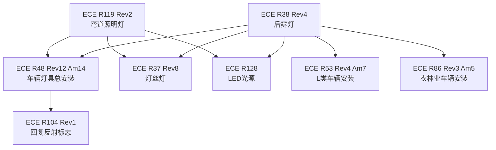

# 社区综述：灯具安装 / 光源标准 / 车辆照明

## 1. 成员总览
本社区由联合国欧洲经济委员会（ECE）关于车辆照明和光信号装置的法规构成，涵盖总成安装、特定灯具及光源标准。
- **总成安装法规**：
  - [[ECE R48 Rev12 Am14]] — 关于批准机动车辆及其挂车照明和光信号装置安装的统一规定
  - [[ECE R53 Rev4 Am7]] — 关于批准L类车辆照明和光信号装置安装的统一规定
  - [[ECE R86 Rev3 Am5]] — 关于批准农用或林业车辆照明和光信号装置安装的统一规定
- **特定灯具法规**：
  - [[ECE R38 Rev4]] — 关于批准机动车辆及其挂车后雾灯的统一规定
  - [[ECE R119 Rev2]] — 关于批准机动车辆弯道照明灯的统一规定
  - [[ECE R104 Rev1]] — 关于批准M、N和O类车辆回复反射标志的统一规定
- **光源标准**：
  - [[ECE R37 Rev8]] — 关于批准用于机动车辆及其挂车已批准灯具单元的灯丝灯的统一规定
  - [[ECE R128]] — 关于批准用于已批准灯具单元的发光二极管（LED）光源的统一规定

## 2. 内部关系结构
社区内部关系呈现以总成安装法规为核心，特定灯具法规和光源标准为支撑的星型引用网络。

**核心枢纽**：[[ECE R48 Rev12 Am14]] 是车辆照明和光信号装置安装的“母法规”，规定了各类灯具在车辆上的安装位置、数量、几何可见度等通用要求。[[ECE R38 Rev4]] 和 [[ECE R119 Rev2]] 等具体灯具法规，在定义自身性能要求的同时，必须引用R48以确保安装合规性。
**层级引用**：具体灯具法规（如R38、R119）向上引用总成安装法规（R48、R53、R86），向下引用光源标准（R37、R128），形成了“安装要求←灯具性能←光源特性”的三层技术规范体系。

## 3. 同类对比
本社区成员均为ECE法规，属于同一法规体系，因此不存在不同国家/地区法规间的直接限值或方法差异。对比主要体现在对不同车辆类别和不同光源技术的覆盖上：
- **车辆类别覆盖差异**：[[ECE R48 Rev12 Am14]] 主要针对M、N、O类（即乘用车、货车、挂车），而 [[ECE R53 Rev4 Am7]] 和 [[ECE R86 Rev3 Am5]] 则分别针对L类（摩托车等）以及农用或林业车辆。这些法规在安装要求上会根据车辆类型的特点（如尺寸、用途、行驶环境）进行调整。
- **光源技术代际差异**：[[ECE R37 Rev8]] 规范传统的灯丝灯（白炽灯），而 [[ECE R128]] 则专门针对LED光源。两者在光电参数、测试方法（如颜色、光通维持率、热管理等）上存在根本性区别，反映了照明技术的演进。具体灯具法规（如R38、R119）需要同时引用这两类光源标准，以兼容新旧技术。

## 4. 关键议题与潜在矛盾
**引用滞后风险**：[[ECE R119 Rev2]]（2016年发布）引用了 [[ECE R128]]（LED光源标准）。然而，R128的发布日期未知，且社区内其他成员（如R38 Rev4）也引用了它。如果R128在2016年后有重大修订，而R119 Rev2未同步更新其引用，则可能导致基于旧版R128测试的弯道照明灯，其LED光源性能要求已落后于技术发展或安全考量。这构成了法规引用版本滞后的典型风险。

**范围与定义的潜在交叉**：[[ECE R104 Rev1]] 规范的是“回复反射标志”，其主题被归类为`body_markings`（车身标记），而社区其他成员均为`lighting_signaling`（照明信号）。虽然R104被R48引用，明确了其在车辆上的安装要求，但“回复反射”功能介于被动反光与主动发光之间。这种分类差异可能在实际认证中引发界定模糊，例如，某些兼具回复反射和微弱主动发光功能的装置，应适用R104还是其他主动灯具法规。

**版本并存与修订同步性**：社区内核心法规如 [[ECE R48 Rev12 Am14]]、[[ECE R53 Rev4 Am7]]、[[ECE R86 Rev3 Am5]] 均在2023年发布了修订案（Amendments）。而具体灯具法规 [[ECE R38 Rev4]] 发布于2021年，[[ECE R119 Rev2]] 发布于2016年。这意味着具体灯具法规在制定时，引用的可能是这些总成安装法规的较早版本。虽然修订案通常会保持向后兼容或明确过渡期，但仍存在一种风险：即最新安装要求中的细微调整（如对某个安装位置的补充说明）可能未被较早发布的具体灯具法规的测试流程充分考虑，需要认证机构额外关注引用关系的具体版本。

## 5. 版本演进时间线
根据现有发布日期信息，勾勒出本社区法规的近期更新脉络：
- **2010年**：[[ECE R104 Rev1]] 发布，确立了车辆回复反射标志的专门法规。
- **2015年**：[[ECE R37 Rev8]] 发布，更新了灯丝灯的技术要求。
- **2016年**：[[ECE R119 Rev2]] 发布，更新弯道照明灯法规，并开始引用LED光源标准（R128）。
- **2021年**：[[ECE R38 Rev4]] 发布，大幅更新后雾灯法规，扩展了对不同车辆类别（L类、农用车）安装要求的引用。
- **2023年**：总成安装法规集中更新。[[ECE R53 Rev4 Am7]]（2月）、[[ECE R86 Rev3 Am5]]（2月）、[[ECE R48 Rev12 Am14]]（6月）相继发布修订案，反映了车辆技术发展和法规协调的最新要求。

## 6. 相关查询示例
- ECE R48关于后雾灯的安装位置和数量具体是如何规定的？
- 为一款新型LED后雾灯进行ECE认证，需要依次满足哪些法规（R38、R48、R128）的哪些测试项目？
- ECE对于摩托车（L类车辆）的照明信号装置安装要求，与普通汽车（M/N类）主要有哪些不同？
