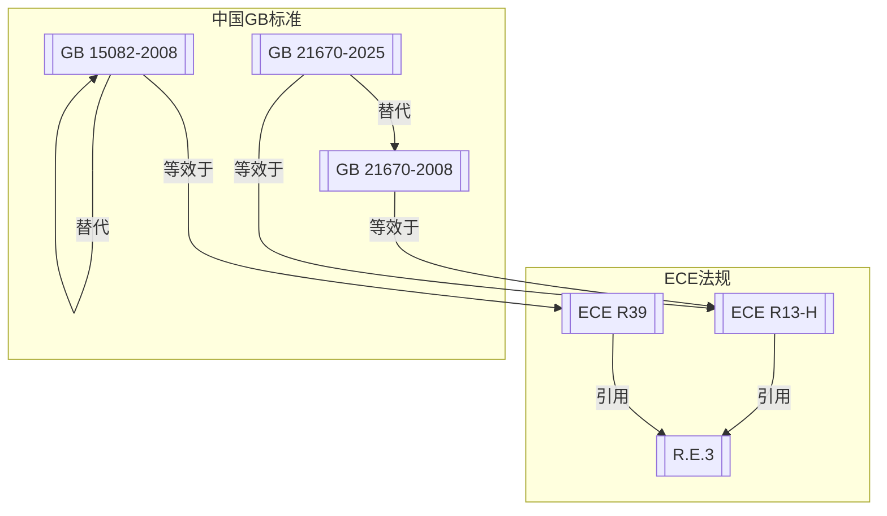

# 社区综述：制动系统 / 车速表 / 结构强度 / 采标ECE

## 1. 成员总览
本社区由联合国欧洲经济委员会（ECE）法规及其对应的中国国家标准（GB）构成，主要涉及车辆制动、车速指示和结构强度三个技术领域。

**ECE法规：**
- [[ECE R13-H]] — 关于乘用车制动认证的统一规定
- [[ECE R39]] — 关于汽车速度表及其安装认证的统一规定
- [[R.E.3]] — 汽车结构的强化标准

**中国国家标准（GB）：**
- [[GB 21670-2008]] — 乘用车制动系统技术要求及试验方法
- [[GB 21670-2025]] — 乘用车制动系统技术要求及试验方法
- [[GB 15082-2008]] — 汽车用车速表

## 2. 内部关系结构
社区内部关系呈现清晰的“采标-引用”网络结构。核心是ECE法规，中国GB标准通过“等效于”关系采标ECE，同时ECE法规之间通过“引用”关系形成技术关联。

**关键关系解读：**
1.  **版本链**：中国制动标准存在明确的版本演进关系，[[GB 21670-2025]] 替代了 [[GB 21670-2008]]。
2.  **采标关系**：中国两项核心安全标准均采标自ECE法规。[[GB 21670-2008]] 和 [[GB 21670-2025]] 均等效于 [[ECE R13-H]]；[[GB 15082-2008]] 等效于 [[ECE R39]]。
3.  **引用链**：ECE法规内部存在技术依赖。制动法规 [[ECE R13-H]] 和车速表法规 [[ECE R39]] 均引用了结构强度标准 [[R.E.3]]，表明在ECE体系中，制动和车速表系统的认证可能涉及对车辆结构强度的考量或引用其测试方法。

## 3. 同类对比
本社区内存在明确的同类法规对比，主要体现在中国标准与源ECE法规的发布时间差异上。

**制动法规的采标时间延迟**：
- **ECE R13-H** 发布于 **1998年**。
- 其等效的中国标准 **GB 21670-2008** 发布于 **2008年**，时间延迟约 **10年**。
- 新版 **GB 21670-2025** 发布于 **2025年**，距离其采标的源法规 **ECE R13-H (1998)** 已过去 **27年**。这表明GB 21670-2025所等效的“ECE R13-H”很可能并非指1998年的原始版本，而是指代一个经过多次修订、在2025年时现行有效的“ECE R13”系列法规。这揭示了采标关系表述中可能存在的“版本指向模糊”问题。

**车速表法规的自我替代**：
- 关系图中显示 [[GB 15082-2008]] 替代了自身（`supersedes: GB 15082-2008`）。这通常意味着该标准替代了其更早的版本（如GB 15082-1999），但在当前数据集中未包含该旧版本。其采标的源法规 [[ECE R39]] 同样发布于1998年，与GB 15082-2008也存在约10年的时间差。

## 4. 关键议题与潜在矛盾
**1. 版本指向模糊与潜在技术滞后风险**：[[GB 21670-2025]] 声明等效于 [[ECE R13-H]]。然而，ECE R13-H是1998年的版本。在1998年至2025年间，UNECE的制动法规（ECE R13）必然经历了多次重要修订，以纳入新技术（如电子稳定性控制系统ESC、自动紧急制动AEB等）和更严格的测试要求。如果GB 21670-2025仅等效于27年前的旧版ECE法规，将导致中国制动技术要求严重滞后于国际主流水平，形成“技术覆盖缺口”。更可能的情况是，“ECE R13-H”在此处作为一个系列法规的统称，但缺乏明确的修订版本号（如“ECE R13/11”），造成了法规溯源和合规判断的模糊地带。

**2. 交叉引用带来的合规范围延伸**：[[ECE R13-H]] 和 [[ECE R39]] 均引用了 [[R.E.3]]（汽车结构的强化标准）。这意味着，在ECE认证框架下，对制动系统和车速表的认证，可能需要间接考虑或符合R.E.3中关于结构强度的某些规定。然而，等效采用这两项ECE法规的中国标准 [[GB 21670-2025]] 和 [[GB 15082-2008]]，其文本中是否同样引用了或包含了R.E.3的相关要求，存在不确定性。如果中国标准未将此类交叉引用关系完整转化，则可能导致“合规范围差异”：即同一车型满足ECE认证需考虑结构强度关联项，而满足中国GB认证则可能无需考虑，造成技术标准实质上的不完全对等。

**3. 新旧版本并存期的合规风险**：[[GB 21670-2025]] 替代 [[GB 21670-2008]]，但两者在关系图中均标记为“active”（有效）。这通常意味着新标准发布后，旧标准会有一段过渡期。在过渡期内，企业可能面临双重标准选择。关键在于，新旧两版标准均等效于“ECE R13-H”，但如上所述，这个指向是模糊的。如果新版GB实际上等效于ECE R13的最新修订，而旧版等效于较早修订，那么选择申请基于旧版GB的认证，虽然合法，但可能导致产品技术状态落后。这构成了“版本并存”下的技术路线选择风险。

## 5. 版本演进时间线
根据现有成员的发布日期，可以勾勒出该社区法规演进的关键节点：
- **1997年8月**: [[R.E.3]] 发布，为后续制动和车速表法规提供了结构强度方面的引用基础。
- **1998年5月**: [[ECE R39]] 发布，确立了车速表认证的ECE统一规定。
- **1998年6月**: [[ECE R13-H]] 发布，确立了乘用车制动认证的ECE统一规定，并引用了R.E.3。
- **2008年4月**: 中国集中发布了两项采标自ECE的关键安全标准：[[GB 15082-2008]]（车速表）和 [[GB 21670-2008]]（制动系统），实现了对约10年前ECE法规的转化。
- **2025年5月**: 中国发布新版制动标准 [[GB 21670-2025]]，替代2008年版，标志着中国乘用车制动技术要求进入新阶段，但其与ECE法规的同步性仍需具体技术内容确认。

## 6. 相关查询示例
- GB 21670-2025与ECE R13最新修订版（如ECE R13/11）在制动性能限值和测试方法上有何具体差异？
- 在中国进行车型认证时，GB 21670是否像ECE R13-H那样，要求核查与R.E.3相关的结构强度项目？
- 对于同时出口欧洲和在中国销售的车型，如何协调满足ECE R13和GB 21670可能存在的细微技术要求差别？
