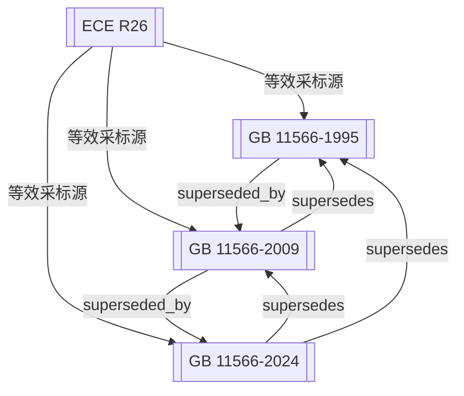

# 社区综述：外部凸出物 / 乘用车安全 / 采标ECE

## 1. 成员总览
本社区围绕乘用车外部凸出物安全法规，包含一个国际法规和三个中国国家标准版本。
- **国际法规**：
  - [[ECE R26]] — 关于车辆就其外部凸出物认证的统一规定
- **中国国家标准**：
  - [[GB 11566-1995]] — 轿车外部凸出物
  - [[GB 11566-2009]] — 乘用车外部凸出物
  - [[GB 11566-2024]] — 乘用车外部凸出物

## 2. 内部关系结构
本社区结构清晰，呈现“一源三版”的树状关系。核心是联合国欧洲经济委员会（ECE）的法规[[ECE R26]]，它作为技术源头，被中国的三个国家标准版本等效采用。中国标准内部则构成一个完整的版本演进链：1995版被2009版替代，2009版又被2024版替代。所有中国标准版本均指向[[ECE R26]]，表明其技术内容的一致性继承关系。

## 3. 同类对比
本社区内法规的“同类对比”主要体现在中国标准自身版本的演进上，而非不同区域法规间的技术差异。所有中国标准（GB 11566系列）均等效采用[[ECE R26]]，因此在核心的技术要求、限值（如凸出物的曲率半径、高度、压力测试值等）和试验方法上保持一致。主要的对比点在于：
1.  **适用范围名称的演变**：[[GB 11566-1995]]的标题为“轿车外部凸出物”，而2009版和2024版均改为“乘用车外部凸出物”。这反映了标准适用范围的扩展或术语的规范化，从“轿车”到更广义的“乘用车”。
2.  **法规状态的迭代**：三个中国标准版本处于不同的生命周期阶段，[[GB 11566-1995]]和[[GB 11566-2009]]已废止（superseded），而[[GB 11566-2024]]为现行有效（active）版本。这构成了时间线上的版本对比。

## 4. 关键议题与潜在矛盾
**版本并存与过渡期风险**：根据关系图，[[GB 11566-2024]]对[[GB 11566-1995]]和[[GB 11566-2009]]均具有“supersedes”关系。这意味着在2024版发布后，旧版标准应被废止。然而，在法规实际执行中，新产品认证必须立即采用新标准，但已按旧标准认证的在产车型可能存在一个过渡期。若过渡期安排不明确或企业对新版理解不足，可能导致生产一致性管控的风险。

**采标源版本滞后风险**：所有中国GB标准均等效于[[ECE R26]]。输入信息显示[[ECE R26]]的日期为“2000-12”，而最新的[[GB 11566-2024]]于2024年发布。这存在一个长达约24年的潜在技术版本差。虽然“等效”关系可能意味着中国标准采纳了ECE法规在某一时间点的稳定版本，但无法确认[[ECE R26]]在2000年后是否有修订案（如系列修正）。如果ECE法规在2000年后有重要的技术更新，而中国标准未同步，则可能导致中国技术要求与国际最新实践脱节。

**标准范围定义的潜在模糊性**：[[GB 11566-1995]]称为“轿车”，后续版本改为“乘用车”。虽然“乘用车”范围通常更广，但在标准换版初期，可能存在对“轿车”与“乘用车”具体车型覆盖范围解释不一致的情况。例如，某些多用途车辆（如部分MPV、SUV）在1995版时代可能未被明确涵盖，而在执行2009版时是否需要追溯，可能引发合规解释上的争议。

## 5. 版本演进时间线
- **1995年**：[[GB 11566-1995]]发布，中国首次建立轿车外部凸出物国家标准，等效采用当时的ECE R26技术内容。
- **2000年**：[[ECE R26]]发布（或形成当前被采标的稳定版本），作为国际技术基准。
- **2009年**：[[GB 11566-2009]]发布，替代1995版，标准名称由“轿车”改为“乘用车”，技术内容继续等效于ECE R26。
- **2024年**：[[GB 11566-2024]]发布，替代2009版，成为现行有效标准，维持对ECE R26的等效采用关系。

## 6. 相关查询示例
- GB 11566-2024版相对于2009版主要有哪些技术变化？
- 出口欧洲的乘用车，其外部凸出物是否只需满足ECE R26即可视为符合中国GB 11566？
- 对于2024年之前已按GB 11566-2009认证的车型，在2024年之后生产是否需要重新认证？
