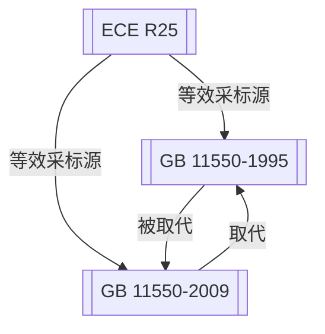

# 社区综述：头枕 / 座椅安全 / 采标ECE

## 1. 成员总览
本社区由一项联合国欧洲经济委员会（ECE）法规和两项中国国家标准构成，均聚焦于汽车座椅头枕的安全性能。
- [[ECE R25]] — 关于头枕（不论其是否与座椅连为一体）认证的统一规定
- [[GB 11550-1995]] — 汽车座椅头枕 性能要求和试验方法
- [[GB 11550-2009]] — 汽车座椅头枕强度要求和试验方法

## 2. 内部关系结构
社区内部关系清晰，呈现一个以ECE R25为源头，中国标准进行采标并迭代演进的结构。
- **版本链**：中国国家标准内部存在明确的版本更替关系。[[GB 11550-2009]] 直接取代了 [[GB 11550-1995]]。
- **采标关系**：中国标准与ECE法规之间存在等效采标关系。[[GB 11550-1995]] 和 [[GB 11550-2009]] 均被标注为与 [[ECE R25]] 等效。这表明中国在头枕安全法规领域，长期以ECE R25作为技术蓝本。

## 3. 同类对比
本社区的核心成员是技术等效关系，因此其主要技术要求和试验方法在原则上应保持一致。然而，从法规标题的细微变化中，可以观察到一些侧重点的演变：
- **法规名称演变**：[[GB 11550-1995]] 的标题为“汽车座椅头枕 性能要求和试验方法”，而 [[GB 11550-2009]] 更新为“汽车座椅头枕强度要求和试验方法”。标题从宽泛的“性能要求”聚焦到具体的“强度要求”，这可能反映了标准修订时对核心安全指标的进一步明确和强化。但两者均等效于 [[ECE R25]]，表明基础框架未变。
- **状态与时效性**：[[ECE R25]] 自1997年发布后，在社区内作为单一版本被长期采标。而中国标准则完成了从1995版到2009版的迭代，后者为现行有效标准。这体现了中国在保持与国际法规协调一致的同时，对本国标准进行独立管理和版本更新的过程。

## 4. 关键议题与潜在矛盾
**长期单一源版本采标**：作为采标源的 [[ECE R25]] 版本为1997年发布。中国在2009年修订标准时，仍等效于此版本。考虑到汽车安全技术的快速发展，ECE R25本身在1997年后可能已有修订或增补件。中国标准长期等效于一个可能已“过时”的源版本，存在**技术更新滞后**的风险，可能导致中国的头枕安全要求未能及时吸纳国际最新的安全研究成果或测试方法改进。

**标准标题聚焦化可能隐含范围收窄**：[[GB 11550-2009]] 将标题从“性能要求”改为“强度要求”。虽然“强度”是头枕最核心的安全性能，但“性能”可能涵盖更广，如耐久性、吸能特性等。这种术语变化**可能引发对标准适用范围解读的争议**：新标准是否仅关注强度，而不再对头枕的其他性能（如非强度相关的舒适性或调节功能安全性）提出要求？这需要仔细对比标准全文才能确定，但标题的修改本身留下了语义模糊的空间。

**“等效”关系的时效性与版本对应模糊**：关系数据表明，[[GB 11550-1995]] 和 [[GB 11550-2009]] 均“等效于”同一个 [[ECE R25]]。这引出一个关键问题：两个技术内容可能存在差异的中国标准版本，如何能同时等效于同一个外部法规版本？这**暴露了“等效”这一元数据标签的粗糙性**。它可能仅表示“基于”或“参考”，而非严格的逐条技术等同。更精确的标注应指明等效于ECE R25的哪个特定版本或修订状态，否则会误导用户对技术一致性的理解。

## 5. 版本演进时间线
本社区法规的演进体现了中国汽车安全标准从引入国际法规到自主更新管理的过程。
- **1995年**：[[GB 11550-1995]] 发布。中国首次制定专门的汽车座椅头枕国家标准，技术内容等效于当时的国际主流法规。
- **1997年**：[[ECE R25]] 发布。联合国欧洲经济委员会正式推出关于头枕认证的统一技术规定，成为该领域重要的国际基准。
- **2009年**：[[GB 11550-2009]] 发布并生效。中国对头枕标准进行了修订，取代1995年版，标准名称聚焦于“强度要求”。
- **2009年后**：[[GB 11550-2009]] 成为现行有效标准，并继续维持与 [[ECE R25]] 的等效关系。而ECE R25的原始版本（1997）在社区关系图谱中仍作为被采标对象，未体现其自身的可能更新。

## 6. 相关查询示例
- GB 11550-2009 与 ECE R25 在头枕后移量限值上是否有差异？
- 中国头枕法规（GB 11550）是否涵盖了集成式头枕（与座椅一体）的要求？
- 除了强度测试，现行的GB 11550-2009对头枕的吸能性能有规定吗？
