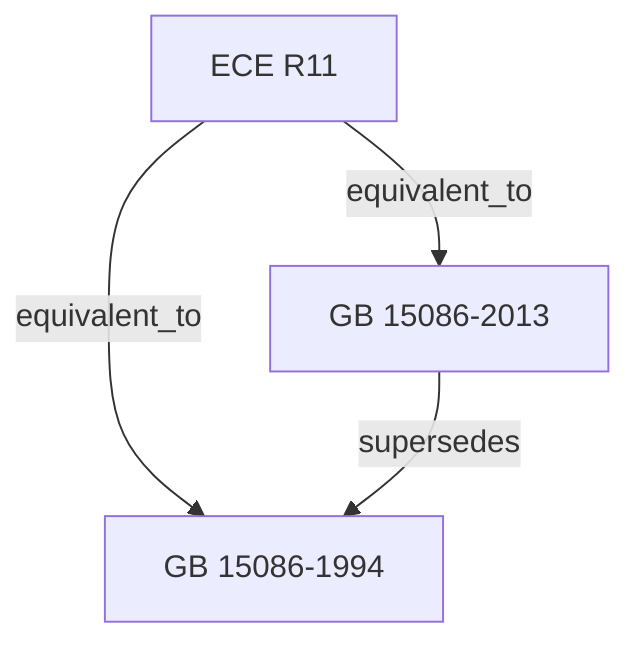

# 社区综述：门锁 / 车门保持件 / 性能要求 / 采标

## 1. 成员总览
- [[ECE R11]] — 关于汽车门锁及车门保持件认证的统一规定
- [[GB 15086-1994]] — 汽车门锁及门铰链的性能要求和试验方法
- [[GB 15086-2013]] — 汽车门锁及车门保持件的性能要求和试验方法

## 2. 内部关系结构
这是一个以联合国欧洲经济委员会（ECE）法规为核心，中国国家标准（GB）进行采标的简单社区。其关系结构清晰：
- **采标关系**：中国标准 [[GB 15086-1994]] 和 [[GB 15086-2013]] 均与 [[ECE R11]] 建立了“等效于”（`equivalent_to`）的关系。这表明中国标准在技术内容上等效采用了ECE法规。
- **版本更替关系**：[[GB 15086-2013]] 取代（`supersedes`）了 [[GB 15086-1994]]，构成了中国国内标准的版本演进链。

## 3. 同类对比
由于社区内仅包含一个核心国际法规（ECE R11）及其两个等效的中国版本，缺乏其他区域（如美国FMVSS）或同类但独立发展的法规实例，因此无法进行深入的“同类不同实例”的横向对比，例如对比欧盟、中国、美国在门锁强度、动态测试条件或锁止系统要求上的具体差异。本社区主要呈现的是**国际法规向国家标准的纵向转化与演进**。

## 4. 关键议题与潜在矛盾
**版本并存与过渡期风险**：根据输入数据，[[GB 15086-1994]] 和 [[GB 15086-2013]] 的状态均为“active”。这意味着在法规执行层面，新旧两版标准可能同时有效，或处于一个较长的过渡期。这会给制造商和认证机构带来困惑，不清楚应具体遵循哪个版本，可能导致产品设计和认证的不一致。

**标准名称与范围演变**：对比两个GB版本，标题从“汽车门锁及门铰链的性能要求和试验方法”（1994版）变更为“汽车门锁及车门保持件的性能要求和试验方法”（2013版）。术语从“门铰链”变为“车门保持件”，后者是更接近 [[ECE R11]] 中“door retention components”的译法，范围可能更广。这种术语变更可能影响对法规适用范围的解读，需要仔细核对两个版本正文中具体定义的差异。

**采标滞后与更新脱节**：[[ECE R11]] 最初发布于1986年，[[GB 15086-1994]] 于1994年等效采用，时间差为8年。[[GB 15086-2013]] 发布时，距离ECE R11原始版本已过去27年。在此期间，ECE R11本身很可能经历了多次修订（如01、02系列修正案）。如果GB 15086-2013仅等效于1986年的原始版本，而未跟进采纳后续的ECE修订案，则会导致中国标准在技术上落后于国际最新要求，形成“引用滞后”的风险。

## 5. 版本演进时间线
- **1986年**：[[ECE R11]] 发布，确立了汽车门锁及车门保持件认证的国际统一技术规定。
- **1994年**：[[GB 15086-1994]] 发布，中国首次等效采用ECE R11，制定了相应的国家标准。
- **2013年**：[[GB 15086-2013]] 发布，取代1994版标准，并维持了与ECE R11的等效关系。标准名称中的“门铰链”改为“车门保持件”。

## 6. 相关查询示例
- GB 15086-2013与1994版相比，在门锁强度测试方面有哪些主要技术变更？
- ECE R11的最新修订版（如系列修正案）是什么？GB 15086-2013是否等效于最新版？
- 除了ECE R11，美国FMVSS 206关于门锁和车门保持件的要求与中国GB 15086有何不同？
