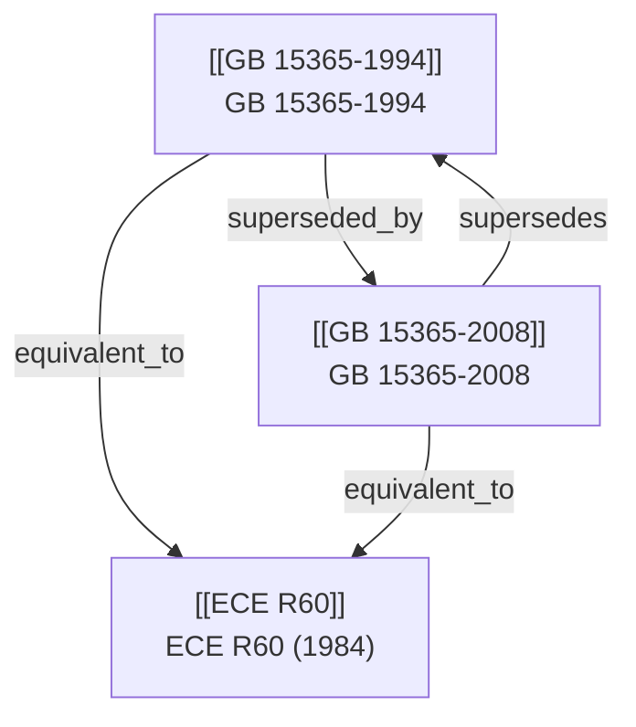

# 社区综述：摩托车 / 图形符号 / 操纵指示器 / 采标

## 1. 成员总览
- [[ECE R60]] — UNIFORM PROVISIONS CONCERNING THE APPROVAL OF TWO-WHEELED MOTOR CYCLES AND MOPEDS WITH REGARD TO DRIVER OPERATED CONTROL
- [[GB 15365-1994]] — 摩托车操纵件、指示器及信号装置的图形符号
- [[GB 15365-2008]] — 摩托车和轻便摩托车操纵件、指示器及信号装置的图形符号

## 2. 内部关系结构
该社区结构清晰，呈现一个典型的“国际法规-国家标准”采标与国内标准升级的演进模式。核心关系如下：
1.  **版本替代链**：[[GB 15365-1994]] 被其修订版 [[GB 15365-2008]] 所替代（`superseded_by`），后者替代了前者（`supersedes`），构成国内标准的线性升级路径。
2.  **采标关系**：两版中国国家标准均与联合国欧洲经济委员会（ECE）法规 [[ECE R60]] 建立了“等效于”（`equivalent_to`）的关系。这表明 GB 15365 系列标准在技术内容上主要参考并采纳了 ECE R60 的规定。

## 3. 同类对比
本社区核心主题为摩托车和轻便摩托车上驾驶员操作的控制装置、指示器及信号装置的图形符号。对比主要存在于中国国家标准的两代版本之间，以及与所采标的国际法规之间。
- **法规范围与名称**：[[GB 15365-1994]] 的标题为“摩托车操纵件、指示器及信号装置的图形符号”，而 [[GB 15365-2008]] 将范围明确扩展为“摩托车和轻便摩托车”，与 [[ECE R60]] 覆盖“Two-Wheeled Motor Cycles and Mopeds”的范围更加一致，体现了标准适用性的完善。
- **技术内容与采标基准**：两版 GB 标准均声明与 [[ECE R60]] 等效。这意味着在图形符号的设计、含义、尺寸、颜色、位置等核心技术要求上，中国标准基本遵循了 ECE 法规。主要的差异可能体现在标准文本的表述、编排格式以及符合中国法规体系要求的规范性引用文件等方面，而非实质性的技术指标冲突。

## 4. 关键议题与潜在矛盾
**1. 采标时间延迟与版本锁定**：[[ECE R60]] 最初发布于 **1984年**。[[GB 15365-1994]] 于1994年发布并采标，时间差为10年。[[GB 15365-2008]] 于2008年发布，距离 ECE R60 原始版本已过去24年。虽然 GB 标准声明“等效”，但并未指明等效于 ECE R60 的哪个修订状态。→ **影响/风险**：在长达数十年的时间里，ECE R60 本身可能经历了多次修订和增补。中国标准长期锁定在（或基于）一个可能早已过时的国际法规原始版本，可能导致国内技术要求与国际最新实践脱节，存在技术滞后风险。

**2. 标准状态与市场实际应用的脱节**：根据输入信息，两版中国国家标准 [[GB 15365-1994]] 和 [[GB 15365-2008]] 的状态均为“`superseded`”（被替代）。然而，并未提供替代它们的最新标准版本信息。→ **影响/风险**：这造成了一个信息缺口。摩托车和轻便摩托车图形符号的现行有效国家标准是什么？是 GB 15365 的更新版（如201X版），还是该要求已被整合到其他更广泛的车辆型式认证标准中？这种状态不明确会给制造商、检测机构和监管部门带来困惑，影响标准执行的清晰度。

**3. 范围定义的潜在演变与协调**：[[GB 15365-2008]] 将适用范围从“摩托车”明确扩大到“摩托车和轻便摩托车”，实现了与 [[ECE R60]] 在车型覆盖上更好的对齐。然而，需要审视“轻便摩托车”在中国标准体系（如GB 7258等）中的定义，是否与 ECE 法规中“Moped”的定义完全一致。→ **影响/风险**：如果“轻便摩托车”与“Moped”在技术参数（如排量、速度）上存在定义差异，那么即使标准范围文字相似，其实际约束的车辆群体也可能不同，可能导致国际协调中的细微偏差。

## 5. 版本演进时间线
- **1984年**: [[ECE R60]] 发布 — 联合国 ECE 颁布关于两轮摩托车和轻便摩托车驾驶员操作控制装置批准的统一规定，奠定了图形符号的国际技术基准。
- **1994年**: [[GB 15365-1994]] 发布 — 中国首次制定摩托车操纵件、指示器及信号装置的图形符号国家标准，并等效采用 ECE R60。
- **2008年**: [[GB 15365-2008]] 发布 — 中国修订并替代1994版标准，将适用范围扩展至“摩托车和轻便摩托车”，继续维持与 ECE R60 的等效关系。
- **2008年后**: GB 15365-2008 生效，GB 15365-1994 废止 — 中国摩托车图形符号要求进入以2008版为准的阶段。（注：根据输入，2008版目前状态也为“被替代”，但替代标准未知。）

## 6. 相关查询示例
- 当前在中国市场销售的摩托车，其仪表盘和操控按钮上的图形符号应遵循哪个最新、有效的国家标准？
- ECE R60 自1984年以来有哪些重要的修订案？GB 15365-2008 具体等效于其中哪个版本？
- 除了GB 15365，中国在摩托车操纵指示器方面还有哪些相关的强制性标准或技术法规？
