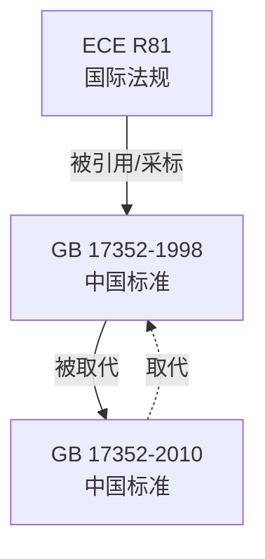

# 社区综述：摩托车后视镜 / 中国标准 / 采标ECE

## 1. 成员总览
本社区由一项联合国欧洲经济委员会（ECE）法规和两项中国国家标准组成，均围绕摩托车和轻便摩托车的后视镜展开。
- [[ECE R81]] — Uniform provisions concerning the approval of rear-view mirrors and of two-wheeled power-driven vehicles with or without
- [[GB 17352-1998]] — 摩托车和轻便摩托车后视镜及其安装要求
- [[GB 17352-2010]] — 摩托车和轻便摩托车后视镜的性能和安装要求

## 2. 内部关系结构
社区内部关系结构清晰，呈现出一个以国际法规为参考、国内标准迭代更新的简单链条。

**版本链**：中国国家标准内部存在明确的版本更替关系。[[GB 17352-2010]] 取代了 [[GB 17352-1998]]，两者构成了一个直接的版本演进链。[[GB 17352-2010]] 目前状态为“被取代”，表明其自身也已被更新的标准所替代，但该新标准不在本社区内。

**采标关系**：社区的核心关系体现在中国标准对国际法规的采纳上。[[GB 17352-1998]] 明确引用了 [[ECE R81]]。这表明1998版中国标准在制定时，很大程度上参考或等效采用了ECE R81法规的技术要求，体现了中国在摩托车安全部件法规领域与国际接轨的早期实践。

**引用链**：整个社区的关系可以概括为：[[ECE R81]] (国际源法规) ← 被 [[GB 17352-1998]] 引用/采标 → [[GB 17352-1998]] (国内初版) → 被 [[GB 17352-2010]] 取代 → [[GB 17352-2010]] (国内修订版)。

## 3. 同类对比
本社区成员属于典型的“国际法规-国内采标标准”模式，对比主要体现在中国标准与其所采标的国际法规之间，以及中国标准自身的版本迭代之间。

1.  **法规性质与范围对比**：[[ECE R81]] 是联合国框架下的型式批准法规，具有国际互认性，其标题显示它还涉及“两轮机动车辆”的某些规定，范围可能更广。而 [[GB 17352-1998]] 和 [[GB 17352-2010]] 是中国的强制性国家标准，仅在中国境内适用，其标题明确限定于“摩托车和轻便摩托车后视镜”。

2.  **技术要求差异（推断）**：由于 [[GB 17352-1998]] 引用了 [[ECE R81]]，可以推断两者在核心性能要求（如视野、反射率、曲率半径、抗冲击性等）和安装要求上应基本一致或非常接近。[[GB 17352-2010]] 作为取代版本，其技术要求可能在1998版（即ECE R81）的基础上有所更新或加严，例如可能引入了更严格的视野测试方法、对镜面失真的新限值、或对材料耐久性的更高要求，以反映技术进步和更高的安全期望。遗憾的是，由于社区信息有限，无法获取具体的技术参数进行量化对比。

3.  **状态与时效性**：[[ECE R81]] 状态为“active”（活跃），表明其仍是现行有效的国际技术法规。而中国的 [[GB 17352-2010]] 状态为“superseded”（被取代），意味着已有更新的国家标准（如GB 17352-202X）发布并实施。这反映了中国标准更新周期与国际法规可能不同步，或根据本国情况进行了独立修订。

## 4. 矛盾与未解议题
当前社区信息有限，但基于现有数据可提出以下观察和潜在议题：

1.  **标准滞后与更新路径不透明**：[[ECE R81]] 自1989年发布后是否经过修订？如果已修订，那么中国在2010年及之后更新标准时，是继续参考1989年的旧版R81，还是参考了其最新修订版？[[GB 17352-2010]] 被取代后，现行有效的中国标准是否依然保持与ECE法规的协调？这些更新路径和协调关系在本社区内无法追溯，形成了一个信息缺口。

2.  **“主题”字段的误导性**：输入信息显示社区主导主题为“brakes”（制动），但所有三个成员的实际内容均明确关于“后视镜”（rear-view mirrors）。[[GB 17352-1998]] 和 [[GB 17352-2010]] 的`topic`字段也被标记为“brakes”，这很可能是一个数据标注错误或分类偏差。后视镜属于“视野与能见度”（visibility）范畴，与制动系统直接关联不大。这提示在更广泛的法规知识图中，此类分类错误可能影响基于主题的检索和分析准确性。

3.  **社区完整性存疑**：本社区仅包含3个节点，且最新的中国标准（取代GB 17352-2010的标准）并未包含在内。这使得社区无法反映该技术领域当前完整的法规生态，尤其是中国最新的技术要求及其与国际法规的对比关系。这是一个明显的未完成状态。

## 5. 相关查询示例
- GB 17352-2010标准在哪些具体技术条款上修改或加强了GB 17352-1998的要求？
- 中国现行的摩托车后视镜国家标准（GB 17352-XXXX）与ECE R81的最新版本是否还存在技术性差异？
- ECE R81法规中关于后视镜视野和曲率半径的核心限值是多少？
