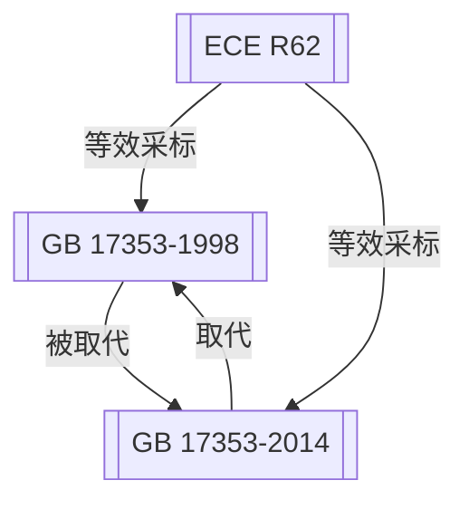

# 社区综述：摩托车 / 防盗装置 / 转向锁止

## 1. 成员总览
本社区由一项联合国欧洲经济委员会（ECE）法规和两项中国国家标准构成，均围绕摩托车防盗装置的技术要求。
- [[ECE R62]] — UNIFORM PROVISIONS CONCERNING THE APPROVAL OF POWER-DRIVEN VEHICLES WITH HANDLEBARS WITH REGARD TO THEIR PROTECTION AGAINST UNAUTHORIZED USE
- [[GB 17353-1998]] — 摩托车和轻便摩托车 转向锁止防盗装置
- [[GB 17353-2014]] — 摩托车和轻便摩托车防盗装置

## 2. 内部关系结构
本社区结构清晰，呈现一个以国际法规为源头，中国标准进行采标并迭代演进的关系网络。
- **版本链**：中国国家标准内部存在明确的版本更替关系。[[GB 17353-2014]] 取代了 [[GB 17353-1998]]。
- **采标关系**：两项中国国家标准均与 [[ECE R62]] 建立了“等效于”的关系。这表明 GB 17353 系列标准在技术内容上采纳了 ECE R62 的规定。
- **引用链**：[[ECE R62]] 作为源头法规，被两个中国版本引用，是社区的核心参考依据。

## 3. 同类对比
本社区的核心法规在技术要求和适用范围上高度一致，主要差异体现在法规的演进和名称的调整上。
- **法规名称与范围**：[[ECE R62]] 的标题明确指向“带方向把的机动车辆”，而 [[GB 17353-1998]] 的标题为“转向锁止防盗装置”，强调了具体的防盗形式。到了 [[GB 17353-2014]]，标题简化为“防盗装置”，这可能意味着标准覆盖的防盗技术类型（如转向锁止、电子防盗等）有所扩展或定义更加宽泛，但核心要求仍与 ECE R62 保持一致。
- **版本状态**：[[ECE R62]] 自1984年发布后状态仍为“active”，而 [[GB 17353-1998]] 已被取代，[[GB 17353-2014]] 为现行有效标准。这体现了中国标准体系对国际法规的跟踪和本土化更新。

## 4. 关键议题与潜在矛盾
**版本并存与引用滞后**：[[GB 17353-2014]] 与 [[ECE R62]] 建立了“等效于”关系。然而，ECE R62 自1984年发布后，可能存在后续的修订案或增补件。如果中国标准在2014年修订时，等效的是1984年的原始版本，而未追踪或纳入ECE后续的修订，则可能存在**技术内容滞后**的风险。这可能导致符合最新中国国标的产品，与符合最新ECE法规的产品在细节要求上产生差异。

**定义与范围演进模糊性**：[[GB 17353-2014]] 将名称从1998版的“转向锁止防盗装置”改为“防盗装置”。这种名称的泛化，如果没有在标准正文中清晰界定其与旧版“转向锁止”范围的具体继承与扩展关系，可能引发**合规范围解释的争议**。制造商和认证机构需要明确，新标准是仅涵盖了转向锁止，还是包含了其他类型的防盗装置（如电子防盗器），这直接影响产品设计和认证路径。

**长期未更新的国际源法规**：[[ECE R62]] 的发布日期为1984年，距今已近40年。虽然状态显示为“active”，但摩托车防盗技术（尤其是电子化、智能化防盗）已发生翻天覆地的变化。一项近40年未作重大更新的法规，可能无法充分应对现代盗窃手段，存在**技术过时**的潜在风险。中国标准等效采标此类历史悠久的法规，需要评估其技术先进性和适用性是否仍能满足当前的安全需求。

## 5. 版本演进时间线
- **1984年**: [[ECE R62]] 发布 — 联合国欧洲经济委员会（ECE）首次就带方向把车辆（摩托车等）的防盗装置提出统一技术规定。
- **1998年**: [[GB 17353-1998]] 发布 — 中国首次制定摩托车防盗装置国家标准，等效采用ECE R62，并明确聚焦于“转向锁止”装置。
- **2014年**: [[GB 17353-2014]] 发布并生效 — 中国对摩托车防盗装置标准进行修订，取代1998版，标准名称去除了“转向锁止”的限定，范围可能有所调整，但仍保持与ECE R62的等效关系。

## 6. 相关查询示例
- GB 17353-2014 与 ECE R62 在防盗装置测试方法上有何具体差异？
- 摩托车电子防盗器是否需要满足 GB 17353-2014 的要求？
- ECE R62 是否有最新的修订版本，GB 17353 标准未来是否会随之更新？
