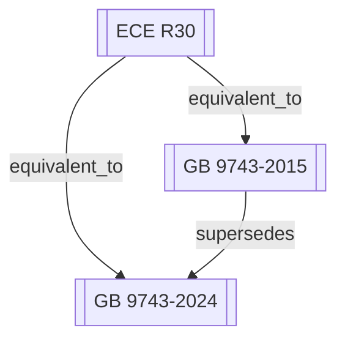

# 社区综述：轿车轮胎 / 充气轮胎 / 认证标准

## 1. 成员总览
- [[ECE R30]] — 机动车辆和挂车用充气轮胎认证的统一规定
- [[GB 9743-2015]] — 轿车轮胎
- [[GB 9743-2024]] — 轿车轮胎

## 2. 内部关系结构
该社区结构清晰，呈现一个以国际法规为基准，国内标准迭代更新的典型模式。核心关系如下：
- **版本链**：[[GB 9743-2015]] 被 [[GB 9743-2024]] 所取代（`supersedes`），构成中国轿车轮胎标准的国内演进主线。
- **采标关系**：中国标准与联合国欧洲经济委员会（ECE）法规之间存在明确的等效关系。[[GB 9743-2015]] 和 [[GB 9743-2024]] 均被标记为与 [[ECE R30]] `equivalent_to`。这表明中国轿车轮胎标准在技术内容上等效采用了ECE R30的规定，是典型的国际法规本土化案例。

## 3. 同类对比
本社区的核心对比在于中国国家标准GB 9743的两个版本（2015版与2024版）之间的演进。虽然两者均等效于ECE R30，但新版标准的发布通常意味着技术要求的更新、测试方法的完善或安全限值的加严。例如，新版标准可能引入了对新型轮胎（如缺气保用轮胎、低滚阻轮胎）的特定要求，更新了高速、耐久性等性能试验的测试程序，或采纳了ECE R30后续修正案中的最新技术要求。由于输入信息未提供具体技术差异，但根据标准修订惯例，[[GB 9743-2024]] 相较于 [[GB 9743-2015]]，在技术内容上应更贴近当前版本的ECE R30及其修正案，体现了中国轮胎法规与全球技术法规的持续协调。

## 4. 关键议题与潜在矛盾
**版本并存与过渡期风险**：[[GB 9743-2024]] 已于2024年1月1日发布并生效，同时 [[GB 9743-2015]] 的状态仍为“active”。这通常意味着存在一个新旧标准并行的过渡期。对于制造商和认证机构而言，需要明确新旧标准在产品认证、生产一致性检查等方面的适用边界和时间节点，否则可能导致市场准入的混乱或合规性判断的争议。

**采标等效性的时效性滞后**：[[GB 9743-2015]] 等效于 [[ECE R30]]，而 [[GB 9743-2024]] 也等效于同一个 [[ECE R30]]。这里存在一个关键问题：ECE R30本身是一个持续更新的法规系列，包含多个修正案。输入数据中未指明GB标准具体等效于ECE R30的哪个版本（如哪个系列修正案）。如果GB 9743-2024等效的仍是多年前的ECE R30版本，而国际法规已有更新，则会导致中国的技术要求滞后于国际最新发展，形成事实上的技术壁垒或安全水平差异。

**标准范围与术语定义的潜在差异**：[[ECE R30]] 的标题为“机动车辆和挂车用充气轮胎认证的统一规定”，覆盖范围广泛。而 [[GB 9743-2015]] 和 [[GB 9743-2024]] 的标题均为“轿车轮胎”，范围相对具体。虽然GB标准在技术内容上等效采用，但在适用范围（如是否涵盖轻型卡车轮胎C1类别）、术语定义（如“轿车轮胎”与ECE分类的对应关系）上可能存在本土化的调整或解释差异。这种差异需要在产品认证和国际贸易中予以特别注意，避免因范围理解不同导致合规性问题。

## 5. 版本演进时间线
- **2015年**：[[GB 9743-2015]] 发布，替代更早的版本，成为中国轿车轮胎的强制性国家标准，并等效采用ECE R30的相关要求。
- **2024年**：[[GB 9743-2024]] 发布并生效，取代 [[GB 9743-2015]] 成为最新标准，继续维持与ECE R30的等效关系。
- **持续更新**：[[ECE R30]] 作为源头法规，在2015年至2024年期间及之后，可能经历了多次修正案的更新，其技术要求在不断演进。
- **过渡期**：2024年之后的一段时间内，[[GB 9743-2015]] 与 [[GB 9743-2024]] 可能同时处于“active”状态，具体废止或停止用于新认证的时间需依据中国标准化的相关规定。

## 6. 相关查询示例
- GB 9743-2024相对于2015版在轮胎高速性能测试方面有哪些主要变化？
- 符合ECE R30认证的轿车轮胎，是否可以直接认为满足GB 9743-2024的要求？
- 在GB 9743-2024生效后，已按GB 9743-2015认证的轮胎产品有多长的销售过渡期？
