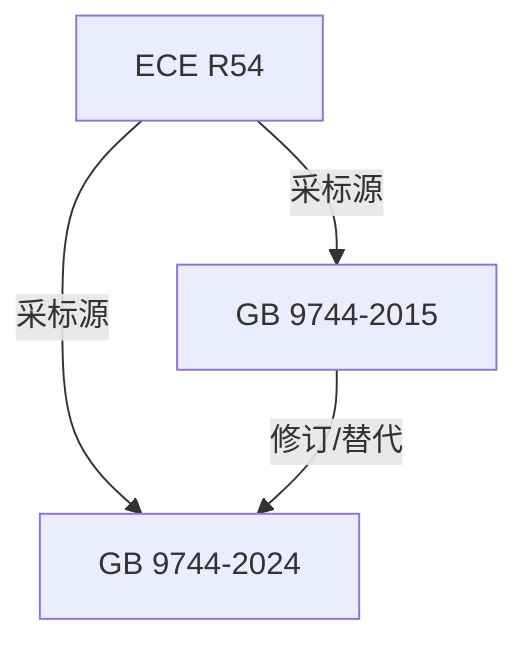

# 社区综述：载重汽车轮胎 / 商用车轮胎 / 充气轮胎认证

## 1. 成员总览
本社区聚焦于商用车（载重汽车）轮胎的法规与标准，包含一个国际法规和两个中国国家标准。
- [[ECE R54]] — 商用车辆和挂车用充气轮胎认证的统一规定
- [[GB 9744-2015]] — 载重汽车轮胎
- [[GB 9744-2024]] — 载重汽车轮胎 国家标准第1号修改单

## 2. 内部关系结构
本社区结构清晰，呈现“一源两版”的采标关系。
- **版本链**：中国国家标准内部存在版本演进关系。[[GB 9744-2024]] 是 [[GB 9744-2015]] 的修改单，即对2015版标准的技术内容进行了修订和更新。
- **采标关系**：中国标准均以联合国欧洲经济委员会（ECE）的法规为蓝本。[[GB 9744-2015]] 和 [[GB 9744-2024]] 均与 [[ECE R54]] 建立了“equivalent_to”（等效于）的关系。这表明中国标准在技术要求和认证方法上，整体采纳了ECE R54的规定。

## 3. 同类对比
本社区的核心对比在于中国标准与其采标源国际法规的版本时间差，以及中国标准自身的版本迭代。
- **法规版本时效性对比**：[[ECE R54]] 的版本日期为2001年8月。而等效采标它的 [[GB 9744-2015]] 发布于2015年，两者存在约14年的时间差。这反映了中国标准在采纳国际先进法规时，存在一定的滞后周期。[[GB 9744-2024]] 作为最新修改单，其具体发布日期未提供，但可以推断其旨在更新2015版标准，可能同步了ECE R54在2001年之后的一系列修订案或补充了新的技术要求，以缩小与国际最新实践的差距。
- **标准形式对比**：[[ECE R54]] 作为联合国法规，其结构更侧重于为全球范围内的型式认证提供统一的技术规定和测试程序。而 [[GB 9744-2015]] 及 [[GB 9744-2024]] 作为中国国家标准，在采纳国际要求的同时，其文本表述、测试条件的具体化（如引用中国环境标准）以及市场监督的衔接方面，会更具本土化特征。

## 4. 关键议题与潜在矛盾
**时间延迟与技术同步风险**：[[GB 9744-2015]] 等效于2001年版的 [[ECE R54]]，而ECE法规本身可能已在过去二十多年中经历了多次修订（如01系列、02系列修正本）。如果 [[GB 9744-2024]] 修改单未能完全吸纳这些后续修订，则中国标准在部分最新安全要求（如高速性能、耐久性测试条件、轮胎标识等）上可能仍与国际主流要求存在代差，影响中国轮胎产品的国际竞争力与认证便利性。

**版本并存与合规选择模糊性**：根据关系图，[[GB 9744-2024]] 对 [[GB 9744-2015]] 的关系是“supersedes”（替代）。然而，两者状态均为“active”（有效）。这在实际监管中可能造成过渡期内的合规困惑：企业是必须立即执行2024修改单，还是可以在一定期限内选择执行2015版？若无明确的废止日期或过渡期安排，会给生产企业和检测机构带来执行标准的不确定性。

**引用源单一化与适应性风险**：中国轮胎标准体系（至少在本社区范围内）高度依赖 [[ECE R54]] 这一单一国际源。虽然ECE法规具有权威性，但全球轮胎法规体系还包括美国FMVSS 119等。过度依赖单一源，可能使中国标准在应对某些特定市场（如北美）或新兴技术（如智能轮胎、低滚阻轮胎）的认证要求时，缺乏灵活性和全面的技术储备。此外，ECE R54主要针对充气轮胎，对于商用车领域可能出现的其他轮胎类型（如非充气轮胎）的覆盖可能存在缺口。

## 5. 版本演进时间线
- **2001年8月**：[[ECE R54]] 发布，确立了商用车充气轮胎认证的国际统一技术规定。
- **2015年2月4日**：[[GB 9744-2015]] 发布并实施，等效采用ECE R54 (2001)，成为中国商用车轮胎的强制性国家标准。
- **2024年**：[[GB 9744-2024]] （第1号修改单）发布，对2015版标准进行技术修订和更新，状态为有效。
- **当前（推断）**：[[GB 9744-2015]] 与 [[GB 9744-2024]] 修改单并存，共同构成中国载重汽车轮胎的现行有效技术要求。

## 6. 相关查询示例
- GB 9744-2024修改单主要针对2015版标准的哪些技术条款进行了修订？
- 出口欧洲的商用车轮胎，除了满足GB 9744，是否必须完全符合ECE R54的最新修正本？
- 在中国进行载重汽车轮胎CCC认证，应依据GB 9744-2015还是GB 9744-2024？
