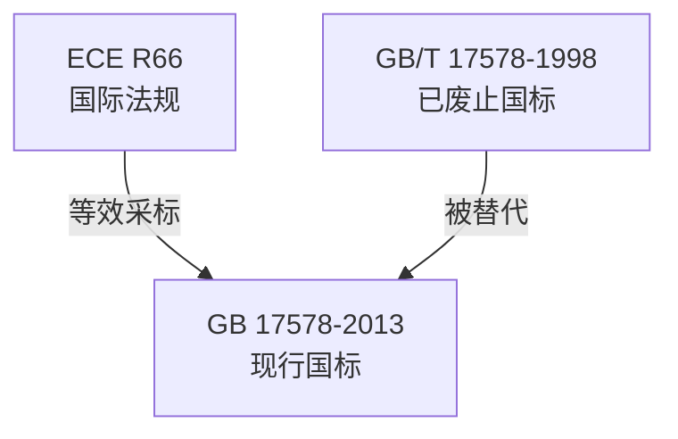

# 社区综述：客车 / 上部结构 / 强度认证

## 1. 成员总览
- [[ECE R66]] — 关于大型客车上层结构强度认证的统一规定
- [[GB 17578-2013]] — 客车上部结构强度要求及试验方法
- [[GB/T 17578-1998]] — 客车上部结构强度的规定

## 2. 内部关系结构
该社区结构清晰，呈现一个典型的“国际法规-国内标准”演进路径。核心关系如下：
- **版本替代关系**：[[GB 17578-2013]] 完全替代了其前身 [[GB/T 17578-1998]]，后者状态为“已废止”。
- **采标关系**：[[GB 17578-2013]] 在技术内容上等效于国际法规 [[ECE R66]]，表明中国标准采纳了联合国欧洲经济委员会（ECE）的成熟技术框架。

## 3. 同类对比
本社区成员较少，主要对比体现在中国国家标准与其国际源头的演进关系上。
- **标准性质与效力**：[[ECE R66]] 是国际性的型式认证技术法规，而 [[GB 17578-2013]] 是中国国家强制性标准，具有法律约束力。其前身 [[GB/T 17578-1998]] 为推荐性国家标准（GB/T），强制力较弱。
- **标准名称与术语**：[[ECE R66]] 使用“上层结构”，而中国标准 [[GB 17578-2013]] 和 [[GB/T 17578-1998]] 均使用“上部结构”，体现了术语的本土化翻译。核心技术要求（如侧翻试验的能量要求、生存空间标准）在等效采标后应保持一致。

## 4. 关键议题与潜在矛盾
**标准性质与强制力演变**：[[GB/T 17578-1998]] 为推荐性标准，而 [[GB 17578-2013]] 升级为强制性标准。这意味着在2013年标准实施后，客车制造商必须满足该强度要求，否则产品无法上市销售。这反映了中国对客车被动安全，特别是侧翻事故中乘员保护的高度重视和监管强化。

**采标时间延迟与版本追踪**：[[ECE R66]] 作为源头法规，其本身存在多个修订版本（如01、02系列修正案）。[[GB 17578-2013]] 等效采标时，是基于当时有效的 ECE R66 版本。然而，ECE R66 后续的修订内容（如果有）并未自动同步到中国标准中。这可能导致中国标准在技术细节上滞后于国际最新发展，存在技术更新脱节的风险。

**标准覆盖范围与定义衔接**：[[ECE R66]] 的标题明确指向“大型客车”，而 [[GB 17578-2013]] 的标题简化为“客车”。虽然在实际应用中，该标准主要针对M2、M3类客车（即中型和大型客车），但标题的简化可能引发对标准适用范围（是否涵盖小型客车）的歧义。这种术语差异需要在标准正文的“范围”章节中予以明确界定，否则可能产生执行层面的困惑。

## 5. 版本演进时间线
- **1998年**：[[GB/T 17578-1998]] 发布，中国首次建立了客车上部结构强度的国家标准，为推荐性标准。
- **2013年**：[[GB 17578-2013]] 发布并实施，全面替代1998版标准，性质升级为强制性国家标准，并实现了与 [[ECE R66]] 的技术等效。
- **持续有效**：[[ECE R66]] 作为国际基础法规持续有效，并可能经历修订；[[GB 17578-2013]] 作为中国现行强制性标准持续有效。

## 6. 相关查询示例
- 中国客车上部结构强度标准与欧洲ECE R66法规的具体技术差异有哪些？
- GB 17578-2013 相对于其1998版旧标准，主要增加了哪些要求或修改？
- 进行客车侧翻强度认证时，是依据GB 17578还是ECE R66？两者可以互认吗？
