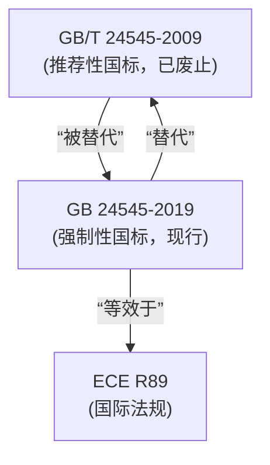

# 社区综述：车速限制 / 限速装置 / 技术标准

## 1. 成员总览
- [[ECE R89]] — 关于对限制最高车速的车辆认证、对装有已认证限速装置（SLD）的车辆认证和对限速装置（SLD）认证的统一规定
- [[GB 24545-2019]] — 车辆车速限制系统技术要求及试验方法
- [[GB/T 24545-2009]] — 车辆车速限制系统技术要求

## 2. 内部关系结构
该社区结构清晰，呈现一个典型的“国际标准-国内标准”演进模式。核心关系如下：
- **版本替代关系**：[[GB 24545-2019]] 完全替代了其前身 [[GB/T 24545-2009]]，标志着中国车速限制系统标准从推荐性国家标准（GB/T）升级为强制性国家标准（GB）。
- **采标关系**：[[GB 24545-2019]] 在技术上等效于联合国欧洲经济委员会（ECE）的法规 [[ECE R89]]。这表明中国标准在核心要求上与国际主流法规保持一致。

## 3. 同类对比
本社区的核心法规 [[GB 24545-2019]] 与 [[ECE R89]] 在技术内容上为等效关系，因此两者在限速装置的**核心技术要求、试验方法和认证程序**上基本一致。例如，两者都规定了限速装置（SLD）的设定车速、车速控制精度、系统响应时间、故障指示等关键性能指标。这种一致性有利于中国生产的、装有符合国标限速装置的车辆，在满足国内法规的同时，也更容易获得基于 ECE R89 的国际认证，促进出口。

然而，一个重要的**非技术性差异**在于法规的**性质与范围**：
- **[[ECE R89]]**：是联合国框架下的型式认证法规，其适用性取决于各缔约国是否将其纳入本国法律体系。它为各国提供了一个统一的认证基准。
- **[[GB 24545-2019]]**：是中国境内的**强制性国家标准**，对在中国境内生产、销售、注册的适用车辆具有法律约束力。其“强制性”属性（GB vs GB/T）体现了中国对车辆主动安全，特别是商用车等特定车型最高车速控制的严格监管。

## 4. 关键议题与潜在矛盾
**标准属性升级与追溯性**：[[GB 24545-2019]] 由推荐性标准（GB/T）升级为强制性标准（GB）。这意味着在2019年标准实施后，相关车型必须满足新国标要求。对于在2009年至2019年间仅依据旧推荐性标准 [[GB/T 24545-2009]] 进行设计或认证的车辆产品，在法规切换期可能存在合规性风险，需要重新评估或进行产品升级以满足强制性要求。

**国际法规动态与国内标准更新延迟**：[[GB 24545-2019]] 等效采用的是 [[ECE R89]]。然而，ECE 法规本身会随着技术发展和安全需求进行修订（如 R89 的系列修正案）。目前社区数据未显示 GB 24545-2019 引用了 ECE R89 的特定修订版本号。这带来潜在风险：如果 ECE R89 在2019年后发布了重要的技术修订，而 GB 标准未能及时跟踪更新，可能导致中国标准与国际最新要求产生**技术代差**，影响出口产品的认证效率。

**术语与范围的本土化差异**：虽然技术等效，但在具体实施中，中国标准 [[GB 24545-2019]] 的适用范围（如适用的车辆类别、质量范围等）定义，必须与中国车辆管理体系（如 GB 7258《机动车运行安全技术条件》）相衔接。而 [[ECE R89]] 的适用范围则与 ECE 的车辆分类体系挂钩。这种**管理体系差异**可能导致看似等效的两个法规，在实际适用于具体车型时，产生细微的合规性判断区别，需要企业仔细核对。

## 5. 版本演进时间线
- **2009年**：[[GB/T 24545-2009]] 发布，中国首次建立车辆车速限制系统的推荐性国家标准，初步构建技术框架。
- **2019年**：[[GB 24545-2019]] 发布并实施，全面替代2009版标准，标准性质从“推荐性”升级为“强制性”，标志着中国对车辆限速装置的监管进入强制实施阶段，并在技术上明确等效于国际法规 [[ECE R89]]。
- **当前状态**：[[GB 24545-2019]] 为现行有效强制性标准，[[GB/T 24545-2009]] 已废止，[[ECE R89]] 作为国际基准法规持续有效并可能更新。

## 6. 相关查询示例
- 我的商用车要满足中国强制性认证（CCC），其限速装置应符合 [[GB 24545-2019]] 还是 [[ECE R89]]？
- [[GB 24545-2019]] 相对于已废止的 [[GB/T 24545-2009]]，主要增加了哪些试验方法或技术要求？
- 如果我的车辆已通过基于 ECE R89 的欧盟WVTA认证，进入中国市场时，其限速装置是否自动满足 GB 24545-2019 的要求？
