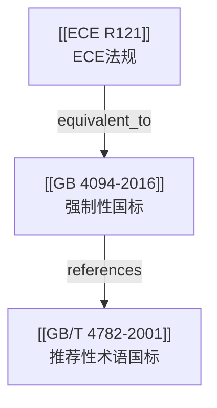

# 社区综述：操纵件 / 指示器 / 标志 / 词汇

## 1. 成员总览
- [[ECE R121]] — 关于手控装置、信号装置和指示器位置及识别的车辆认证的统一规定
- [[GB 4094-2016]] — 汽车操纵件、指示器及信号装置的标志
- [[GB/T 4782-2001]] — 道路车辆 操纵件、指示器及信号装置 词汇

## 2. 内部关系结构
本社区结构清晰，以中国国家标准为核心，与国际法规形成采标关系，并辅以术语标准。
- **采标关系**：[[GB 4094-2016]] 与 [[ECE R121]] 存在 `equivalent_to` 关系，表明前者在技术内容上等效采用了后者。
- **引用关系**：强制性标准 [[GB 4094-2016]] 引用了推荐性术语标准 [[GB/T 4782-2001]]，后者为前者提供了术语定义基础。
- **版本更替**：[[GB 4094-2016]] 和 [[GB/T 4782-2001]] 均存在 `supersedes` 关系，表明它们各自替代了更早的版本（如 GB 4094-1999 和 GB/T 4782-1984），但社区内未包含这些旧版本。

## 3. 同类对比
本社区核心法规 [[GB 4094-2016]] 与 [[ECE R121]] 在技术内容上为等效采用关系，因此两者在核心要求上（如标志的图形符号、颜色、位置、识别性等）应基本一致。主要差异体现在法规的属性和适用范围上：
- **法规属性**：[[ECE R121]] 是联合国欧洲经济委员会（UNECE）的型式认证法规，用于欧洲及采纳该法规的国家的车辆认证。[[GB 4094-2016]] 是中国国家强制性标准（GB），是中国境内汽车产品必须满足的技术要求。
- **法律效力**：在中国市场，车辆必须符合 GB 4094 的要求。ECE R121 本身在中国无直接法律效力，但其技术内容通过 GB 4094 的采标而间接适用。
- **更新机制**：ECE 法规的修订流程可能与中国国标的修订流程不同步，可能导致在一段时间内存在技术细节上的微小差异或更新延迟。

## 4. 关键议题与潜在矛盾
**术语标准滞后**：[[GB 4094-2016]] 引用了发布于 2001 年的术语标准 [[GB/T 4782-2001]]。该术语标准已发布超过 20 年，期间汽车技术（尤其是电气化、智能化带来的新操纵件和指示器，如驾驶模式选择、能量回收、自动驾驶状态指示等）飞速发展。旧术语标准可能无法覆盖新功能，导致制造商在为新装置命名和定义时缺乏统一依据，或与标准引用关系脱节。

**采标版本不明确**：[[GB 4094-2016]] 等效采用 [[ECE R121]]，但 ECE R121 本身可能经历多次修订。输入信息仅提供了 ECE R121 的发布日期（2006年），而 GB 4094-2016 于 2016 年发布。**关键问题在于**：GB 4094-2016 具体等效采用了 ECE R121 的哪个修订版本？是 2006 年的原始版本，还是截至 2016 年的某个修订版？若采标的是旧版，则可能未包含 ECE 法规在 2006-2016 年间的重要更新，造成中国标准与国际最新要求存在“隐性差距”。

**标准类型与强制力错配**：社区内存在强制性标准（GB）引用推荐性标准（GB/T）的结构。[[GB 4094-2016]]（强制）引用了 [[GB/T 4782-2001]]（推荐）。这意味着，强制标准中的部分术语定义依赖于一个非强制性的文件。如果 [[GB/T 4782-2001]] 被修订或作废，而 [[GB 4094-2016]] 未同步更新其引用，将导致强制标准所依赖的规范性引用文件失效或变更，可能引发符合性判断上的争议和不确定性。

## 5. 版本演进时间线
- **2001年**：[[GB/T 4782-2001]] 发布，统一了道路车辆操纵件、指示器及信号装置的词汇，替代了更早的版本。
- **2006年**：[[ECE R121]] 发布，为国际车辆认证提供了关于操纵件、指示器标志的统一技术规定。
- **2016年**：[[GB 4094-2016]] 发布，等效采用 ECE R121 的技术内容，并更新引用了 GB/T 4782-2001，替代了旧版的 GB 4094（如 1999 版），成为中国汽车产品必须遵循的强制性标准。

## 6. 相关查询示例
- GB 4094-2016 与 ECE R121 在标志颜色和图形符号的具体要求上是否有任何差异？
- 对于智能网联汽车的新增交互装置（如语音助手唤醒键），应参考哪些标准来确定其标志？
- GB/T 4782 是否有更新计划以涵盖电动汽车和自动驾驶相关的操纵件与指示器术语？
